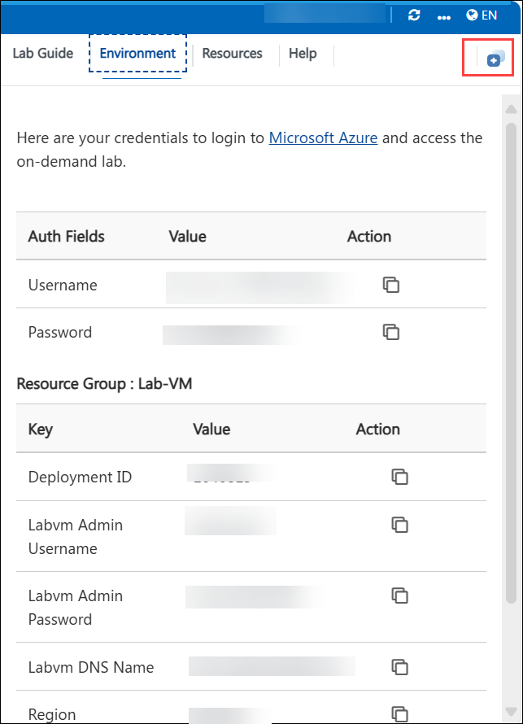
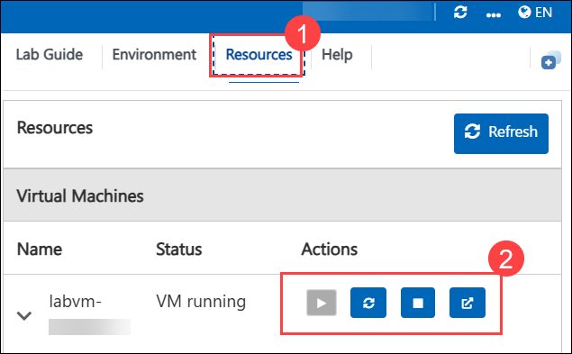

# Challenge Lab

# Capstone Project 

### Overall Estimated Duration: 4 Hours

## Overview

In this challenge, you will work with a Chainlit-based conversational application that utilizes Dapr’s publish-subscribe (pub/sub) messaging model to orchestrate customer service escalations through intelligent AI agents. The solution seamlessly integrates several Azure services—including Azure OpenAI for natural language processing, Cosmos DB for data persistence, and Azure Service Bus for reliable messaging. When AI agents reach their resolution limits, the system intelligently escalates the case to a human support agent by triggering a Logic Apps workflow that sends an approval request via email. This hands-on lab offers valuable insight into how AI-driven conversational interfaces, event-driven architecture, and workflow automation can be combined to create responsive, scalable, and human-aware customer support systems.

## Objective 

By the end of this lab, you will be able to:

- **Smart Escalation System for Conversational Support**: Set up and test an AI-powered escalation system using Azure OpenAI, Dapr, and Logic Apps to route unresolved queries from a chat interface to a human agent.

## Prerequisites

Participants should have:

- Basic understanding of Azure services such as Azure OpenAI, Cosmos DB, and Service Bus.
- Familiarity with Dapr and the pub/sub messaging pattern.
- Experience with deploying applications using Azure Developer CLI (AZD).
- Knowledge of Logic Apps and workflow automation.
- Exposure to conversational AI tools like Chainlit or similar frameworks.
- Basic proficiency in working with APIs and cloud-based integrations.

## Explanation of Components

- **Azure AI Foundry**: A cloud-based platform for developing, deploying, and managing AI models. It allows users to configure AI projects, deploy Large Language Models (LLMs), and integrate embedding models to enhance AI applications.
- **Azure Cosmos DB**: A globally distributed, multi-model NoSQL database service designed for high availability, low latency, and scalability.
- **Azure Service Bus**: A fully managed message broker that enables reliable communication between distributed applications using queues and topics.
- **Azure Container Apps**: A serverless container hosting service that allows you to deploy and scale microservices and containerized applications without managing infrastructure.
- **Azure Logic Apps**: A cloud-based workflow automation service that enables you to integrate apps, data, and services using prebuilt connectors and triggers.

## Getting Started with the lab

Welcome to your Azure Agentic AI Workshop, Let's begin by making the most of this experience:

## Accessing Your Lab Environment

Once you're ready to dive in, your virtual machine and **lab guide** will be right at your fingertips within your web browser.

## Lab Guide Zoom In/Zoom Out

To adjust the zoom level for the environment page, click the **A↕ : 100%** icon located next to the timer in the lab environment.

## Virtual Machine & Lab Guide

Your virtual machine is your workhorse throughout the workshop. The lab guide is your roadmap to success.

## Exploring Your Lab Resources

To get a better understanding of your lab resources and credentials, navigate to the **Environment** tab.

## Utilizing the Split Window Feature

For convenience, you can open the lab guide in a separate window by selecting the **Split Window** button from the Top right corner.

## Managing Your Virtual Machine

Feel free to **start, stop, or restart (2)** your virtual machine as needed from the **Resources (1)** tab. Your experience is in your hands!

<!-- ## Lab Duration Extension

1. To extend the duration of the lab, kindly click the **Hourglass** icon in the top right corner of the lab environment.

    

    >**Note:** You will get the **Hourglass** icon when 10 minutes are remaining in the lab.

2. Click **OK** to extend your lab duration.

   

3. If you have not extended the duration prior to when the lab is about to end, a pop-up will appear, giving you the option to extend. Click **OK** to proceed. -->

> **Note:** Please ensure the script continues to run and is not terminated after accessing the environment.

## Let's Get Started with Azure Portal

1. On your virtual machine, click on the Azure Portal icon.
2. You'll see the **Sign into Microsoft Azure** tab. Here, enter your credentials:

   - **Email/Username:** <inject key="AzureAdUserEmail"></inject>

     

3. Next, provide your password:

   - **Password:** <inject key="AzureAdUserPassword"></inject>

     

4. If **Action required** pop-up window appears, click on **Ask later**.
5. If prompted to **stay signed in**, you can click **No**.
6. If a **Welcome to Microsoft Azure** pop-up window appears, simply click **"Cancel"** to skip the tour.

## Steps to Proceed with MFA Setup if "Ask Later" Option is Not Visible

1. At the **"More information required"** prompt, select **Next**.

1. On the **"Keep your account secure"** page, select **Next** twice.

1. **Note:** If you don’t have the Microsoft Authenticator app installed on your mobile device:

   - Open **Google Play Store** (Android) or **App Store** (iOS).
   - Search for **Microsoft Authenticator** and tap **Install**.
   - Open the **Microsoft Authenticator** app, select **Add account**, then choose **Work or school account**.

1. A **QR code** will be displayed on your computer screen.

1. In the Authenticator app, select **Scan a QR code** and scan the code displayed on your screen.

1. After scanning, click **Next** to proceed.

1. On your phone, enter the number shown on your computer screen in the Authenticator app and select **Next**.
1. If prompted to stay signed in, you can click "No."

1. If a **Welcome to Microsoft Azure** pop-up window appears, simply click "Maybe Later" to skip the tour.

## Support Contact

The CloudLabs support team is available 24/7, 365 days a year, via email and live chat to ensure seamless assistance at any time. We offer dedicated support channels tailored specifically for both learners and instructors, ensuring that all your needs are promptly and efficiently addressed.

Learner Support Contacts:

- Email Support: [cloudlabs-support@spektrasystems.com](mailto:cloudlabs-support@spektrasystems.com)
- Live Chat Support: https://cloudlabs.ai/labs-support

Click **Next** from the bottom right corner to embark on your Lab journey!

Now you're all set to explore the powerful world of technology. Feel free to reach out if you have any questions along the way. Enjoy your workshop!